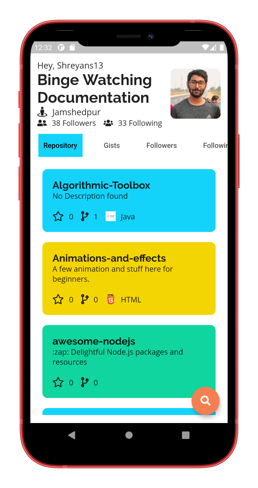
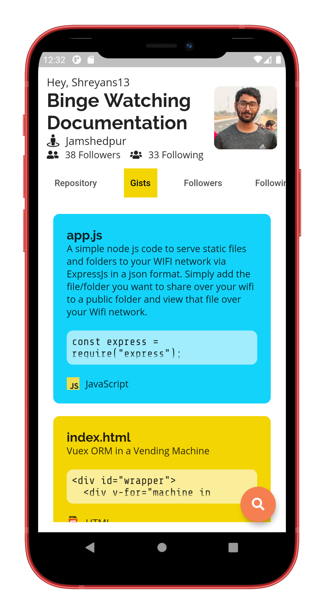
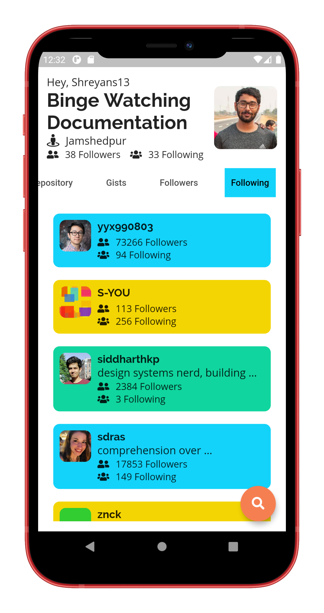

<p align="center"></p>
<h1 align="center">Github Profile Finder</h1>
<p align="center"></p>

## Getting Started
A cross-platform application based on Github`s API made with Flutter.<br>
Inspired from [GithubProfileFinder](https://vtrrix.github.io/Github-profile-finder/).

### APK
[⬇️ Download apk here](https://github.com/Shreyans13)
## Some Features
- Search, Analyse, Share your github profile easily
- Provide Github`s user data based on the username

### Show some :heart: and :star: the repo to support the project. 

## Screenshots

### Mobile
  
  
  
  
  
  
 

## 👍 Contribution
1. Fork it
2. Create your feature branch (git checkout -b my-new-feature)
3. Commit your changes (git commit -m 'Add some feature')
4. Push to the branch (git push origin my-new-feature)
5. Create new Pull Request

### What can you contribute
1. Get more data from github`s api.
2. Find bugs or errors and fix it.
3. Improve UI/UX designs.
4. Add some cool features.

## Project setup

**Step 1:**

Download or clone this repo by using the link below:

```
https://github.com/Shreyans13/github-profile-finder-flutter.git
```

**Step 2:**

Go to project root and execute the following command in console to get the required dependencies:

```
flutter pub get
```

**Step 3:**

Run the project in Android Studio or any IDE you prefer or run the command:

```
flutter run <DART_FILE> or Run the project in android studio
```

**Step 4:**

To build the flutter project:

```
flutter build
```


### Dependencies :innocent:

This project is uses
- cupertino_icons
- flutter_native_splash
- liquid_swipe
- google_fonts
- flutter_svg
- libv_markdown
- font_awesome_flutter
- shared_preferences


## Facing Any Problem or need any Help:grey_question:
Incase you face any problem or need any help write me in [issues](https://github.com/Shreyans13/github-profile-finder-flutter/issues) section. 


